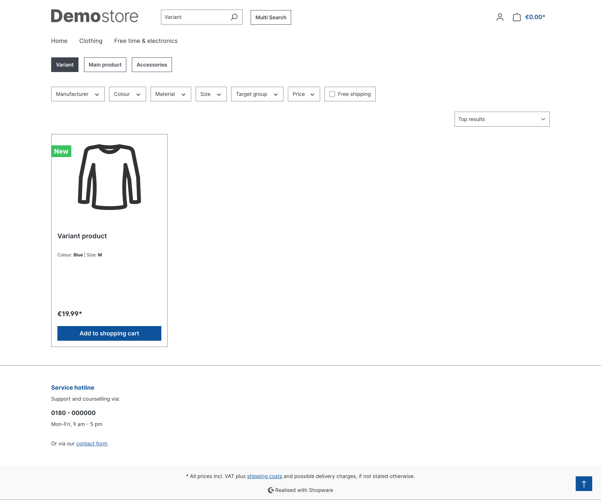

# Multiple Search for Shopware

## An integration for [Shopware 6](https://github.com/shopware/platform) to add a simple but effective multi search functionality

##

**Key Features:**

* **Effortless Multi-Search:** Introduce a user-friendly modal window where users can enter multiple keywords on separate lines.
* **Seamless Integration:** Leverages Shopware's default search listing mechanism, ensuring a familiar and intuitive experience for users.
* **Future-Proof Design:** Employs Shopware's built-in modal for a smooth integration that adapts to future platform updates.
* **Open-Source Collaboration:** Embrace the power of open-source development! This plugin welcomes pull requests to enhance its functionality and foster a thriving community.

**Installation:**

1. **Download the Plugin:** Clone or download the plugin repository using Git.
2. **Place in Shopware Project:** Navigate to your Shopware project directory and copy the plugin files to the `custom/plugins` directory.
3. **Activate the Plugin:** Within your Shopware administration panel, go to **Configuration** > **Plugin Management**. Locate the "Shopware 6 Multi Search Plugin" and activate it.
4. **Clear Cache:** To ensure a clean start, clear the Shopware cache after plugin activation.

**Usage:**

1. **Click the Multi-Search Button:** Look for a button or icon (customize as needed) that triggers the multi-search functionality.
2. **Enter Keywords (One Per Line):** In the modal window that appears, enter your desired search terms on separate lines for each search.
3. **Initiate Search:** Click the "Search" button to execute your multi-search query.

**Search Results:**

- Each search term will be displayed as a distinct tab within the search results page.
- Users can easily switch between tabs to view results for individual searches.
- The search results will seamlessly integrate with Shopware's default search listing format, ensuring a familiar user experience.

**Customization:**

- The plugin offers flexibility for developers to customize the multi-search button's appearance and behavior.
- Consult the plugin's source code for available customization options.

## 

**License:**

This plugin is distributed under the terms of the GPLv2 or later (GPL). Please refer to the [LICENSE](http://www.gnu.org/licenses/gpl-2.0.html) file for more details.

##

**Additional Notes:**

